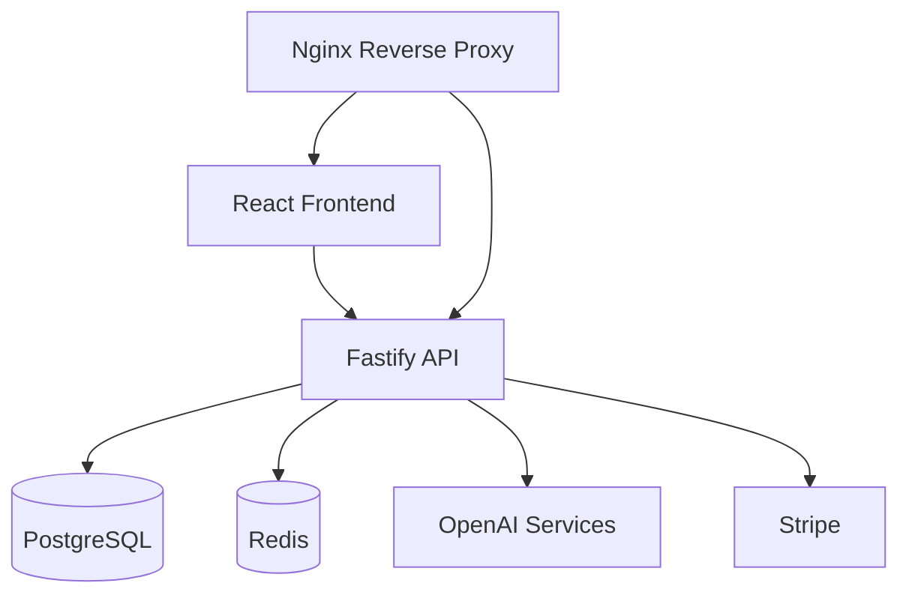

<div align="center">

# Thynkr

### AI-Powered Learning Platform for Active Study

[](https://github.com/NukeByLuke/Thynkr/actions/workflows/ci.yml)
[](https://github.com/NukeByLuke/Thynkr/actions/workflows/codeql.yml)
[](https://github.com/NukeByLuke/Thynkr/actions/workflows/deploy.yml)
[](https://github.com/NukeByLuke/Thynkr/actions/workflows/lighthouse.yml)


Production URL: [https://thynkr.ca](https://thynkr.ca)

</div>

## Why Thynkr
Thynkr transforms static study material into active learning workflows.

It ingests uploaded files, web links, and media sources, then generates study outputs like summaries, quizzes, and flashcards through AI pipelines. The platform is designed as a production-grade full-stack system with a React frontend and Fastify backend.

## Feature Pillars

### AI Study Generation
- Converts source content into summaries, flashcards, and quizzes.
- Supports practical study loops with regeneration and refinement flows.

### Immersive Study UX
- Focused study interface for reading, review, and testing.
- Keyboard-friendly interactions and progressive feedback patterns.

### Progress and Engagement
- Tracks study activity and completion momentum.
- Supports retention workflows through repetition-ready outputs.

### SaaS Product Foundation
- Tier-aware feature access and billing integration.
- Operationally ready deployment and workflow automation.

## Core Features
- AI study generation: summaries, flashcards, and quiz flows.
- Immersive study mode with keyboard-friendly interactions.
- File and source management for mixed learning inputs.
- Progress and engagement systems for sustained study habits.
- Role-aware product behavior for free and paid tiers.

## Architecture



## Tech Stack

### Frontend
- React + TypeScript
- Vite
- Tailwind CSS + Framer Motion
- TanStack Query

### Backend
- Node.js + Fastify
- Prisma ORM
- PostgreSQL
- Redis

### Infrastructure
- Docker and Docker Compose
- Nginx reverse proxy
- DigitalOcean deployment target
- GitHub Actions CI/CD

## Monorepo Layout
```text
thynkr/
	backend/
		prisma/
		src/
			config/
			routes/
			services/
	frontend/
		src/
			components/
			features/
			pages/
	scripts/
	.github/workflows/
	docker-compose.yml
	docker-compose.prod.yml
	nginx.prod.conf
```

## Quick Start

### Recommended bootstrap

Windows (PowerShell):
```powershell
./setup.ps1
```

Linux/macOS:
```bash
chmod +x setup.sh
./setup.sh
```

## Local Setup

### Prerequisites
- Node.js 20+
- pnpm 8+
- Docker Desktop

### 1) Install dependencies
```bash
pnpm install
```

### 2) Start local services
```bash
docker compose up -d postgres redis
```

### 3) Generate Prisma client
```bash
pnpm --filter backend db:generate
```

### 4) Run migrations
```bash
pnpm --filter backend db:migrate
```

### 5) Start app
```bash
pnpm dev
```

Frontend default: `http://localhost:5173`  
Backend default: `http://localhost:3001`

## Environment Notes
- Root `.env` configures backend and deployment concerns.
- `frontend/.env` configures Vite runtime/build variables.
- Keep production secrets out of source control and inject through CI/deployment secrets.

## Quality Commands
```bash
pnpm lint
pnpm typecheck
pnpm build
```

## Key Scripts

```bash
pnpm dev
pnpm build
pnpm test
pnpm lint
pnpm typecheck
```

PowerShell helpers:

```powershell
./scripts/new-feature.ps1
./scripts/merge-feature.ps1
./scripts/release.ps1
```

## Deployment
Production deployment is orchestrated through Docker images and a remote compose stack.

Primary script:
```powershell
./scripts/deploy.ps1
```

Useful flags:
```powershell
./scripts/deploy.ps1 -Component frontend -SkipTests
./scripts/deploy.ps1 -Component backend
./scripts/deploy.ps1 -NoCache
```

Rollback helper:

```powershell
./scripts/rollback-deployment.ps1
```

## Security and Operations Notes
- Secrets are managed through environment variables and deployment secrets.
- CI is configured to run lint/build checks and conditionally run tests when suites exist.
- CodeQL scanning is enabled for JavaScript/TypeScript analysis.

## Contributing
1. Create a feature branch.
2. Keep commits focused and reviewable.
3. Run lint/build locally before opening a PR.
4. Ensure CI checks pass.

## Status
Thynkr is actively developed and deployed with iterative product, reliability, and UX improvements.

## License
MIT (see `LICENSE`).
