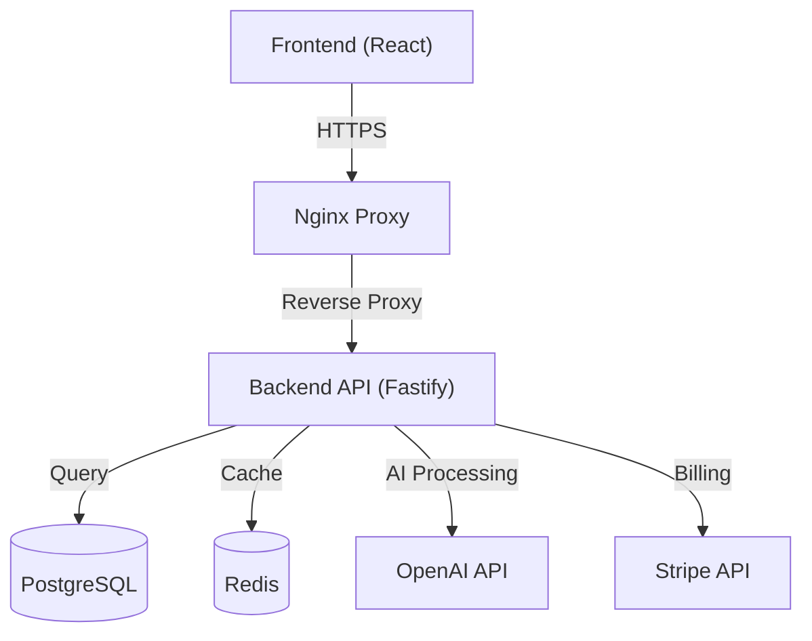

<div align="center">

# Thynkr

[](https://opensource.org/licenses/MIT)
[](https://www.typescriptlang.org/)
[](https://reactjs.org/)
[](https://vitejs.dev/)
[](https://tailwindcss.com/)
[](https://nodejs.org/)
[](https://www.fastify.io/)
[](https://www.postgresql.org/)
[](https://redis.io/)
[](https://www.docker.com/)
[](https://openai.com/)
[](https://stripe.com/)

**An intelligent learning management system that transforms how students study.**

_Made by the DVLPR Team_

[Features](#-features) • [Tech Stack](#-tech-stack) • [Architecture](#-architecture) • [Getting Started](#-getting-started) • [Deployment](#-deployment)

</div>

---

## 🚀 Overview

Thynkr is a modern, AI-powered learning platform designed to optimize the study process. By uploading lecture notes, PDFs, or textbooks, students receive automatically generated, comprehensive study materials tailored to their learning style. From smart summaries to interactive quizzes, Thynkr makes studying smarter, not harder.

## ✨ Features

### 📚 Intelligent Study Tools

- **Smart Summaries**: Instant, concise overviews of complex materials using GPT-4.
- **Auto-Generated Notes**: Key concepts extracted and organized automatically.
- **Interactive Quizzes**: Test your knowledge with AI-generated questions and instant feedback.
- **Digital Flashcards**: Master terms and concepts with spaced repetition.
- **AI Tutor Chat**: Have a conversation with your course materials to clarify doubts.

### 🎓 Course Management

- **Organized Workspace**: Structure files into courses and folders.
- **Progress Tracking**: Visual analytics of your study progress.
- **Cross-Platform**: Seamless synchronization across all your devices.

### 🌍 Global Accessibility

- **Multi-Language Support**: Generate content in 30+ languages.
- **Accessibility First**: Designed for diverse learning needs.

### 💎 Subscription Tiers

- **Free**: Essential tools to get started.
- **Pro**: Enhanced AI capabilities and increased storage.
- **Premium**: Unlimited access to all features and priority processing.

## 🛠 Tech Stack

### Frontend

- **Core**: React 18, TypeScript
- **Build Tool**: Vite
- **Styling**: TailwindCSS, Framer Motion
- **State Management**: TanStack Query, Context API

### Backend

- **Runtime**: Node.js
- **Framework**: Fastify
- **ORM**: Prisma
- **Language**: TypeScript

### Data & Infrastructure

- **Database**: PostgreSQL 16
- **Caching**: Redis 7
- **Containerization**: Docker
- **Cloud**: DigitalOcean
- **Server**: Nginx

### Integrations

- **AI**: OpenAI GPT-4 Turbo
- **Payments**: Stripe

## 🏗 Architecture



## 🚀 Getting Started

### Prerequisites

- **Node.js** 18+
- **pnpm** 8+
- **Docker** & **Docker Compose**

### Installation

1.  **Clone the repository**

    ```bash
    git clone https://github.com/NukeByLuke/Thynkr.git
    cd thynkr
    ```

2.  **Configure Environment**

    ```bash
    cp .env.example .env
    ```

    Update `.env` with your credentials (Database, Redis, OpenAI, Stripe).

3.  **Start with Docker**

    ```bash
    docker-compose up --build
    ```

    - **Frontend**: http://localhost:5173
    - **Backend**: http://localhost:3001

### Manual Development Setup

**Backend**

```bash
cd backend
pnpm install
pnpm prisma migrate dev
pnpm dev
```

**Frontend**

```bash
cd frontend
pnpm install
pnpm dev
```

### 💳 Stripe Setup

1. Install the [Stripe CLI](https://docs.stripe.com/stripe-cli).
2. Run the setup script:
   ```bash
   ./scripts/setup-stripe.ps1
   ```
3. Update your `.env` file with the Price IDs and API keys.

## 📦 Deployment

The application is production-ready and deployed on DigitalOcean.

- **Containerized**: Fully Dockerized services.
- **Secure**: HTTPS enforcement via Nginx.
- **Scalable**: Stateless API design with Redis caching.

## 🤝 Contributing

Contributions are welcome! Please read our [CONTRIBUTING.md](CONTRIBUTING.md) for details on our code of conduct and the process for submitting pull requests.

## 👥 The DVLPR Team

Built with passion by:

- **Luke**
- **Ivan**
- **Harshan**

## 📄 License

© 2025 Thynkr. All rights reserved.
Licensed under the [MIT License](LICENSE).
