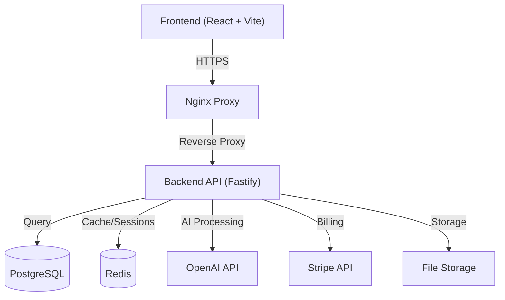

<div align="center">

# Thynkr

### The AI-Powered Learning Ecosystem

[](https://github.com/NukeByLuke/Thynkr/actions)
[](https://opensource.org/licenses/MIT)
[](https://www.typescriptlang.org/)
[](https://reactjs.org/)
[](https://www.fastify.io/)
[](https://www.postgresql.org/)

**Thynkr transforms static study materials into interactive, gamified learning experiences using advanced AI.**

[Features](#-features) • [Tech Stack](#-tech-stack) • [Getting Started](#-getting-started) • [Workflow](#-development-workflow) • [Deployment](#-deployment)

</div>

---

## 🚀 Overview

Thynkr is an enterprise-grade EdTech platform that leverages OpenAI to parse PDFs, documents, and videos into structured study content. It features a **"Zen Mode"** immersive study interface, a comprehensive **gamification system** with tiered achievements, and a robust **subscription model** via Stripe.

**Live Demo:** [https://thynkr.ca](https://thynkr.ca)

---

## ✨ Features

### 🧠 Intelligent Study Engine

- **Smart Parsing:** Extracts text from PDFs, DOCX, PPTX, and YouTube videos
- **AI Content Generation:** Automatically creates Summaries, Bulleted Notes, Interactive Quizzes, and Flashcards
- **Immersive Mode:** A distraction-free "Zen Mode" interface with glassmorphic UI, keyboard navigation, and smooth transitions
- **Text-to-Speech:** Neural audio playback with OpenAI TTS for studying on the go

### 🏆 Gamification & Progression

- **XP System:** Earn experience points for studying, streaks, quiz performance, and content generation
- **Tiered Achievements:** 6-tier system (Bronze → Silver → Gold → Ruby → Diamond → Mastery) for long-term engagement
- **Achievement Notifications:** Beautiful animated popups with tier-specific colors and sounds
- **Study Streaks:** Daily activity tracking with visual indicators

### 📚 Course Management

- **Instructor Marketplace:** Premium users can access curated course content
- **File Organization:** Drag-and-drop folders with batch operations
- **Secure File Delivery:** Token-based secure streaming for video/audio content
- **Progress Tracking:** Per-file and per-course completion analytics

### 💎 Enterprise Architecture

- **SaaS Ready:** Full Stripe integration (Checkout, Customer Portal, Webhooks) with tiered access control
- **Role-Based Access:** BASIC, STANDARD, PREMIUM, and ADMIN tiers with feature gating
- **OAuth Support:** Google Sign-In integration alongside email/password auth
- **Aurora Design System:** Custom Tailwind CSS design system featuring glassmorphism, fluid animations, and dark mode

---

## 🛠 Tech Stack

### Frontend

| Technology          | Purpose                                          |
| ------------------- | ------------------------------------------------ |
| **React 18**        | UI Framework with concurrent rendering           |
| **TypeScript 5.3**  | Type-safe development                            |
| **Vite**            | Lightning-fast build tooling                     |
| **Tailwind CSS**    | Utility-first styling with custom "Aurora" theme |
| **Framer Motion**   | GPU-accelerated animations                       |
| **TanStack Query**  | Server state management with caching             |
| **React Router v6** | Client-side routing with lazy loading            |

### Backend

| Technology        | Purpose                                      |
| ----------------- | -------------------------------------------- |
| **Node.js 20**    | JavaScript runtime                           |
| **Fastify 4.x**   | High-performance web framework               |
| **Prisma ORM**    | Type-safe database access                    |
| **PostgreSQL 16** | Primary data store                           |
| **Redis 7**       | Caching, sessions, and rate limiting         |
| **OpenAI API**    | GPT-4o for content generation, TTS for audio |

### Infrastructure

| Technology         | Purpose                                     |
| ------------------ | ------------------------------------------- |
| **Docker**         | Containerization with multi-stage builds    |
| **Docker Compose** | Local development orchestration             |
| **Nginx**          | Reverse proxy, SSL termination, compression |
| **DigitalOcean**   | Cloud hosting (Droplet + managed DNS)       |
| **GitHub Actions** | CI/CD pipeline                              |

---

## 🏗 Architecture



---

## 🚀 Getting Started

### Prerequisites

- **Node.js** 18+ (20 recommended)
- **pnpm** 8+
- **Docker** & **Docker Compose**
- **Git**

### 1. Clone the Repository

```bash
git clone https://github.com/NukeByLuke/Thynkr.git
cd Thynkr
```

### 2. Automated Setup (Recommended) ⭐

We provide setup scripts that handle database creation, migrations, and configuration automatically:

**Windows (PowerShell):**

```powershell
.\setup.ps1
```

**Linux/macOS:**

```bash
chmod +x setup.sh
./setup.sh
```

The setup script will:

- ✅ Check prerequisites
- ✅ Create environment files
- ✅ Install dependencies
- ✅ Start Docker services (PostgreSQL & Redis)
- ✅ **Create the database** (fixes common setup errors)
- ✅ Run Prisma migrations
- ✅ Generate Prisma Client

### 3. Configure Environment

Edit `.env` and add your API keys:

```env
# Required for AI features
OPENAI_API_KEY=sk-your-openai-api-key-here

# Optional for payment testing
STRIPE_SECRET_KEY=sk_test_your-stripe-secret-key
```

### 4. Start Development Servers

```bash
pnpm dev
```

Services will be available at:

- **Frontend:** http://localhost:5173
- **Backend API:** http://localhost:3001
- **PostgreSQL:** localhost:5432
- **Redis:** localhost:6379

### 5. Create an Admin User (Optional)

```bash
cd backend
node create-admin.js
```

---

### Manual Setup (Alternative)

If you prefer manual setup:

**1. Environment & Dependencies:**

```bash
# Copy environment templates
cp .env.example .env
cp frontend/.env.example frontend/.env

# Install dependencies
pnpm install
```

**2. Start Docker Services:**

```bash
docker-compose up -d postgres redis

# Wait for services to be ready
sleep 10
```

**3. Initialize Database:**

```bash
# Create the database (important!)
docker-compose exec postgres psql -U thynkr -c "CREATE DATABASE thynkr_db;"

# Run migrations
cd backend
pnpm prisma migrate dev
cd ..
```

**4. Start Development:**

```bash
pnpm dev
```

---

## 🔧 Development Workflow

Thynkr includes custom PowerShell scripts to streamline development. These are available as pnpm scripts at the root:

### Create a New Feature Branch

```bash
pnpm feature:new <feature-name>
# Example: pnpm feature:new user-dashboard
# Creates: feature/user-dashboard
```

### Merge Feature to Develop

```bash
pnpm feature:merge
# Merges current feature branch into develop
```

### Create a Release

```bash
pnpm release <version>
# Example: pnpm release 1.2.0
# Runs checks, merges develop → main, creates tag v1.2.0
```

### Deploy to Production

```bash
# Full deployment
.\scripts\deploy.ps1

# Quick deploy (skip tests)
.\scripts\deploy.ps1 -SkipTests

# Deploy specific component
.\scripts\deploy.ps1 -Component frontend
.\scripts\deploy.ps1 -Component backend

# Fresh build (no Docker cache)
.\scripts\deploy.ps1 -NoCache
```

### Rollback

```bash
.\scripts\rollback-deployment.ps1
```

---

## 📦 Deployment

Thynkr is deployed on **DigitalOcean** using Docker containers with Nginx as a reverse proxy.

### Production Architecture

```
┌─────────────────────────────────────────────────┐
│                  DigitalOcean Droplet           │
├─────────────────────────────────────────────────┤
│  ┌─────────────┐  ┌─────────────┐              │
│  │   Nginx     │──│  Frontend   │              │
│  │  (SSL/Gzip) │  │  (React)    │              │
│  └─────────────┘  └─────────────┘              │
│         │                                       │
│  ┌─────────────┐  ┌─────────────┐              │
│  │   Backend   │──│  PostgreSQL │              │
│  │  (Fastify)  │  │             │              │
│  └─────────────┘  └─────────────┘              │
│         │                                       │
│  ┌─────────────┐                               │
│  │    Redis    │                               │
│  └─────────────┘                               │
└─────────────────────────────────────────────────┘
```

### Deployment Pipeline

1. **Build:** Docker images built locally with multi-stage optimization
2. **Push:** Images pushed to Docker Hub
3. **Pull:** Server pulls latest images
4. **Deploy:** Docker Compose orchestrates container updates
5. **Migrate:** Prisma migrations run automatically
6. **Health Check:** Automated verification of all services

---

## 📁 Project Structure

```
thynkr/
├── backend/
│   ├── prisma/           # Database schema & migrations
│   │   └── schema.prisma
│   └── src/
│       ├── config/       # Environment configuration
│       ├── lib/          # Shared utilities (logger, auth)
│       ├── middleware/   # Auth, rate limiting, validation
│       ├── routes/       # API route handlers
│       └── services/     # Business logic (AI, gamification)
├── frontend/
│   └── src/
│       ├── components/   # Reusable UI components
│       ├── contexts/     # React contexts (Auth, Theme, Layout)
│       ├── features/     # Feature-specific modules
│       ├── hooks/        # Custom React hooks
│       ├── layouts/      # Page layouts (Dashboard, Public)
│       ├── lib/          # Utilities (api client, helpers)
│       └── pages/        # Route page components
├── scripts/              # DevOps automation (PowerShell)
├── docker-compose.yml    # Local development
├── docker-compose.prod.yml
└── nginx.prod.conf
```

---

## 🤝 Contributing

Contributions are welcome! Please read our [CONTRIBUTING.md](CONTRIBUTING.md) for details on our code of conduct and the process for submitting pull requests.

### Quick Start for Contributors

1. Fork the repository
2. Create a feature branch: `pnpm feature:new my-feature`
3. Make your changes
4. Run tests: `pnpm test`
5. Run type check: `pnpm typecheck`
6. Submit a pull request

---

## 👥 The DVLPR Team

Built with ❤️ by:

- **Luke** - Full Stack Development
- **Ivan** - Backend Architecture
- **Harshan** - Frontend & Design

---

## 📄 License

© 2025-2026 Thynkr. All rights reserved.

Licensed under the [MIT License](LICENSE).
